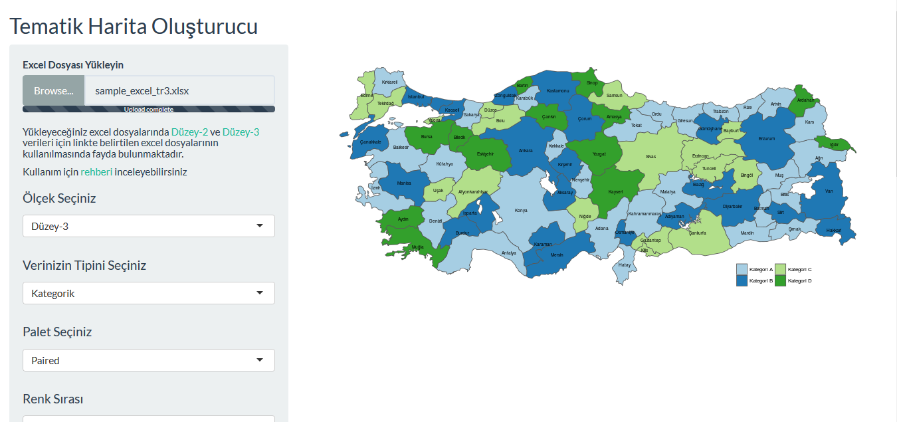
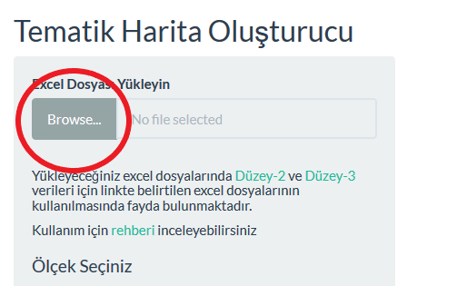

# Tematik Harita Oluşturucu

Bu uygulama ile Türkiye için Düzey-2 ve Düzey-3 ölçeğindeki tematik (choropleth) haritaları kolayca oluşturabilirsiniz. Uygulama Shiny üstçatısı kullanılarak tasarlanmıştır.

Uygulama [https://thematic-maps.shinyapps.io/tr_mapping_app/](https://thematic-maps.shinyapps.io/tr_mapping_app/) adresinden ulaşabilirsiniz.

## Nasıl çalışır?

- Uygulamaya öncelikle kullanılacak verilerin yüklenmesi gerekmektedir. Şu aşamada yalnızca Düzey-3 (İl) ve Düzey-2 bölgeleri ölçeğinde görselleştirme yapılabilmektedir. Veriler yüklemek için uygulamanın sol konsolunda belirtilen excel şablonlarının kullanılmasında fayda bulunmaktadır. Aksi halde kolon isimlerinden kaynaklanan sorunlardan dolayı uyumsuzluk yaşanabilmektedir.

- Excel dosyasını bilgisayarınıza indirdikten sona `DATA` isimli sütuna kullanmak istediğiniz veriyi yapıştırınız. Uygulamaya mevcut durumda yalnızca bir adet değişken yüklenebilmektedir. Bu sebeple excel şablonunda yer alan kolonlara ek olarak herhangi bir kolon veya sekme açılmaması gerekmektedir. Bu yüzden yapmak isteiğiniz het bir harita için ayrı ayrı yükleme yapmanız gerekmektedir.

- Verilerinizi excek dosyasına kopyaladıktan sonra, "Browse" tuşuna basıp excel dosyanızı seçip verilerinizi içe aktarabilirsiniz.

- Uygulama mevcut durum itibariyle verileri kategorik olarak görselleştirmektedir. Örneğin; kullanacağınız veri sayısal bir değer ise  verileri `DATA` alanına kopyalamadan önce verileri kesikli hale getirmeniz gerekmektedir. (0-1000, 1001-2000, 2001-5000 gibi). Çalışacağınız veri kategorik bir veri ise doğrudan `DATA` alanına yükleyebilirsiniz uygulama sorunsuz çalışacaktır.

- Verileri yükledikten sonra verinin ölçeğini seçip haritayı oluştur butonuna tıklayabilirsiniz. Daha sonra sol konsolda yer alan diğer özellikleri kullanarak haritayı istediğiniz şekilde özelleştirebilirsiniz.

